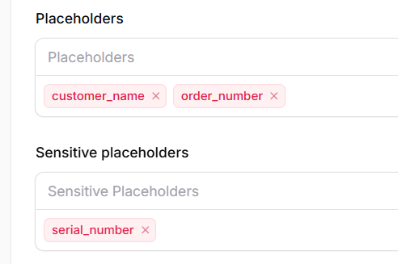

## Setup your development

Please refer to [installation documention](/installation)

## Create your first template

To start working on Mailer, you must create at least one template. You may start to define the placeholders aka—variables in your template. There are two kinds on variables

* Public Placeholders

* Sensitive placeholders aka. private

If you don't want to store sensitive data in the database, you may define your variables in the sensitive placeholders field.&#x20;

The following screenshot shows sharp differences between public and private variables. While sending an email including a serial number which is sensitive information, we may avoid saving this data in the database and audit log.&#x20;

We may also add the email title, HTML and TEXT template.&#x20;

## Update the contact list

## Create a service to handle the submission

## Generate your API key

## Post your first test email

## Tail your API and Email logs